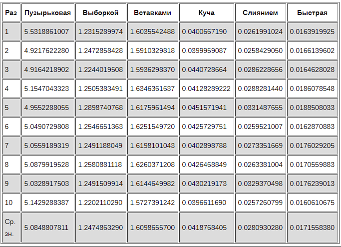
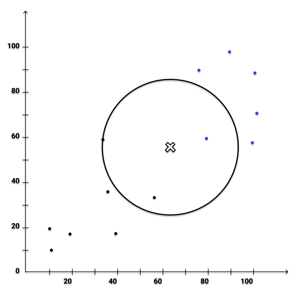
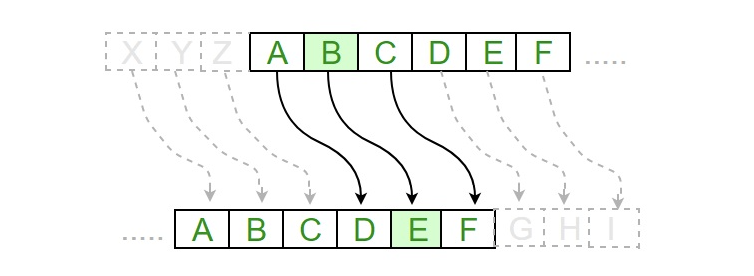

# **Алгоритмы**

---

**Алгоритмы** - некая последовательность шагов, выполняемых для           
решения определённой задачи, выполнения определённого вычисления.        
Алгоритм описывает, какие операции необходимо выполнить, чтобы достичь        
желаемого результата.

**Алгоритм в программировании** - по факту, почти то же самое. Определённая       
последовательность шагов, необходимых для выполнения необходимой задачи на        
компьютере.

Алгоритм описывает, какие операции должны быть выполнены и в каком порядке,       
чтобы получить требуемый результат.

### Хороший алгоритм должен быть **точным**, **эффективным**, **легко понятным** и **реализуемым**         
### на компьютере. Он **должен решать поставленную задачу корректно** и **за разумное время**.

---
Алгоритмов бывает достаточно много разных вариаций и все они, в той или иной мере используются         
в определённом контексте задачи.
Рассмотрим самые популярные (но далеко не все):

### 1. **Жадный алгоритм**

Это такие алгоритмы, которые всегда выбирают локально-оптимальное решение на каждом          
шаге. Эти алгоритмы не всегда делают глобально-оптимальный результат, но могут быть      
эффективными в решении задач о "рюкзаках", расписании.

Эти алгоритмы всегда выбирают наилучшее доступное решение на каждом шаге, без учёта будущих      
последствий. Обычно такие алгоритмы рассматривают раздел математического моделирования      
(нахождение оптимального решения той, или иной задачи.)
При работе с графами - алгоритм Прима или алгоритм Краскала

### 2. **Рекурсивный алгоритм**

`Рекурсивные алгоритмы` - алгоритмы, которые вызывают сами себя для решения подзадачи, которая       
является частью общей задачи. Рекурсивные алгоритмы используются для решения задач, которые      
могут быть разбиты на более мелкие задачи того же типа.

Рекурсивные алгоритмы основаны на двух ключевых компонентах: `базовом случае` и `рекурсивном случае`.           

* `Базовый случай` - это условие, при котором рекурсия завершается и функция перестает вызывать себя.           
Он определяет самую простую версию задачи, которую можно решить напрямую, без дальнейших рекурсивных вызовов.        

* `Рекурсивный случай` - это условие, которое описывает, как задача разбивается на более маленькие подзадачи.           
В рекурсивном случае функция вызывает себя саму для обработки меньших или подобных подзадач, а затем            
комбинирует их результаты для получения решения исходной задачи.            

Рекурсивные алгоритмы могут быть мощным инструментом для решения сложных задач, таких как [обходы деревьев](https://ru.hexlet.io/courses/python-trees/lessons/traversal/theory_unit),              
[поиск путей в графах](https://waksoft.susu.ru/2021/10/21/realizacziya-algoritma-dejkstry-na-python/), `сортировка`, [комбинаторика](https://habr.com/ru/articles/479816/) и др.

### 3. **Алгоритмы поиска**

Используются для нахождения элемента, или набора элементов в заданной структуре данных, такой как         
массив, или список. В Python существует несколько алгоритмов поиска, включая `линейный поиск`, `бинарный поиск`            
`поиск с помощью хэш-таблиц`.

* `линейный поиск` - простейший алгоритм поиска элемента в неупорядоченном массиве. Просматривает каждый элемент массива последовательно, сравнивая его с целевым элементом.
* `бинарный поиск` - алгоритм поиска элемента в отсортированном массиве.
Он делит массив пополам и сравнивает средний элемент с целевым элементом.
Затем он рекурсивно применяет поиск по левой, либо в правой половинах массива, исключая половину, в которой искомый элемент не может находиться.
* `Алгоритм поиска через хэш-таблицы` - использует хэш-функцию для преобразования ключа в индекс массива (хэш-таблицы), где предполагается наличие
искомого элемента. Затем он проверяет значение по полученному индексу и возвращает результат поиска.

### 4. **Алгоритмы сортировки**

Используются для упорядочивания элементов в заданной структуре данных, такой как массив или список.

В Python существует множество алгоритмов сортировки:

* `Сортировка выбором` - Этот алгоритм сегментирует список на две части: отсортированную и неотсортированную. 
Наименьший элемент удаляется из второго списка и добавляется в первый.

(На практике не нужно создавать новый список для отсортированных элементов. В качестве него
используется крайняя левая часть списка. Находится наименьший элемент и меняется с первым местами.

Теперь, когда нам известно, что первый элемент списка отсортирован, находим наименьший элемент из
оставшихся и меняем местами со вторым. Повторяем это до тех пор, пока не останется последний элемент в списке.)

---

* `Сортировка вставками` - Как и сортировка выборкой, этот алгоритм сегментирует список на две части:
отсортированную и неотсортированную. Алгоритм перебирает второй сегмент и вставляет текущий элемент в правильную позицию первого сегмента.

(Предполагается, что первый элемент списка отсортирован. Переходим к следующему элементу, обозначим его `х`.
Если `х` больше первого, оставляем его на своём месте. Если он меньше, копируем его на вторую позицию, а `х`
устанавливаем как первый элемент.

Переходя к другим элементам несортированного сегмента, перемещаем более крупные элементы в отсортированном сегменте
вверх по списку, пока не встретим элемент меньше `x` или не дойдём до конца списка. В первом случае `x` помещается
на правильную позицию.)

---

* `Быстрая сортировка` - Этот алгоритм также относится к алгоритмам «разделяй и властвуй». 
При правильной конфигурации он чрезвычайно эффективен и не требует дополнительной памяти,
в отличие от сортировки слиянием. Массив разделяется на две части по разные стороны от опорного элемента.
В процессе сортировки элементы меньше опорного помещаются перед ним, а равные или большие — позади.

(Быстрая сортировка начинается с разбиения списка и выбора одного из элементов в качестве опорного.
А всё остальное передвигаем так, чтобы этот элемент встал на своё место. Все элементы меньше него перемещаются
влево, а равные и большие элементы перемещаются вправо.)

---

* `Сортировка пузырьком` - Этот простой алгоритм выполняет итерации по списку, сравнивая элементы попарно
и меняя их местами, пока более крупные элементы не «всплывут» в начало списка, а более мелкие не останутся на «дне».

(Сначала сравниваются первые два элемента списка. Если первый элемент больше, они меняются местами.
Если они уже в нужном порядке, оставляем их как есть. Затем переходим к следующей паре элементов, сравниваем
их значения и меняем местами при необходимости. Этот процесс продолжается до последней пары элементов в списке.

При достижении конца списка процесс повторяется заново для каждого элемента. Это крайне неэффективно, если в
массиве нужно сделать, например, только один обмен. Алгоритм повторяется `n²` раз, даже если список уже отсортирован.)

---

#### **Сравнительная таблица для алгоритмов сортировок:**

---

### **Алгоритмы машинного обучения**
**Нейронные сети** - алгоритмы, которые используются для моделирования работы человеческого        
мозга и решения сложных задач обработки информации. Они позволяют компьютеру обучаться        
на основе большого количества данных и принимать решения на основе этих данных.       
Один из самых простых алгоритмов машинного обучения на Python - `алгоритм k-ближайших соседей`(KNN). 

**KNN** - это алгоритм классификации, который основывается на том, что объекты с похожими признаками      
скорее всего принадлежат к одному классу. Алгоритм классифицирует новый объект, основываясь на классах его k ближайших       
соседей в обучающей выборке.
---

---

### **Алгоритмы шифрования**

Методы преобразования данных с целью их защиты от несанкцианированного доступа или изменения.      
Они используются для шифрования информации, такой как сообщения, пароли, кредитные карты и другие конфиденциальные данные.

Один из простых примеров алгоритма шифрования на Python - `шифр Цезаря`, простой метод шифрования, в котором каждая      
буква заменяется на букву, находящуюся на фиксированное число позиций в алфавите. (Например, если выбрать сдвиг       
на три позиции, то буква А будет заменена на D, буква B - на E и так далее.)

**Шифр цезаря:**

---

---

### **Алгоритмы компьютерного зрения**

Алгоритмы, которые используются для анализа и обработки изображений, или видео. Эти алгоритмы       
используются для автоматического распознавания объектов, классификации изображений, обнаружения и распознавания        
лиц, сегментации изображений и других задач компьютерного зрения.

Алгоритмы компьютерного зрения могут включать в себя множество шагов, таких как предобработка изображения (удаление шума)         
выделение объектов на изображении, извлечение признаком объектов, классификация объектов и так далее.

## **Динамическое программирование (разделяй и властвуй)**

#### **Разделяй и властвуй**
Это метод разработки алгоритмов, который заключается в разбиении большой задачи       
на более мелкие, простые подзадачки, которые затем решаются независимо друг от друга, а затем       
объединяются для получения решения исходной задачи.

Классические примеры алгоритмов, использующих этот метод, включают в себя `быструю сортировку`, которая      
сначала разделяет массив на две части, сортирует их отдельно, а затем сливает их вместе в отсортированном порядке,      
и алгоритм `быстрого возведения в степень`, который рекурсивно делит задачу возведения в степень на       
две меньшие задачи, затем решает их и объединяет решения.

---

В большинстве случаев любой сложный алгоритм можно разбить на множество простых.