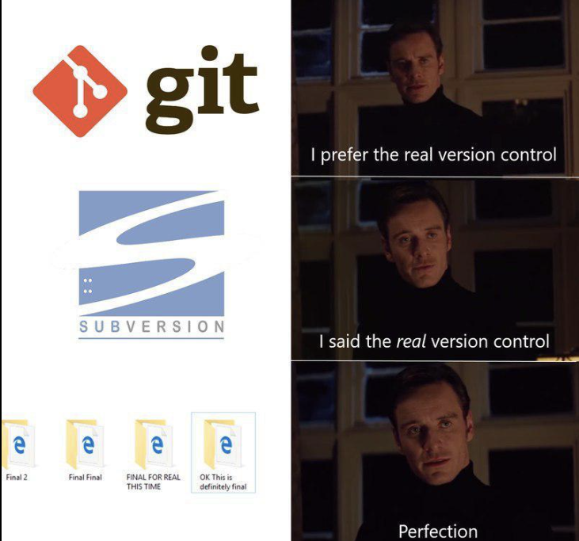

# **Системы контроля версий. GIT**

---



---

**Система контроля версий**(Version Control System, VCS) - инструмент,        
используемый разработчиками для управления изменениями в исходном коде        
и других файловых ресурсах проекта. VCS отслеживает изменения, вносимые          
в файлы, сохраняет их и позволяет восстанавливать предыдущие версии файлов       
при необходимости.


**Основная цель** VCS - представить средства для совместной работы разработчиков        
над проектом и управления изменениями в коде.


### **Что такое версия проекта?**

Это номер, который отражает текущую стадию развития проекта.         
Версия проекта обычно представляется в формате чисел, разделенных точками         
(например, 1.0, 2.3.4). Она используется для отслеживания изменений в проекте        
и управления их жизненным циклом.          


В проектах нумерация версий обычно происходит в формате `X.Y.S`, где:

* `X` - Основная версия, обозначающая крупные изменения в продукте,        
которые могут влиять на совместимость с предыдущими версиями.

* `Y` - Дополнительная версия, обозначающая новые функции и улучшения,       
не влияющие на совместимость.

* `S` - Исправление ошибок, обозначающее мелкие исправления в продукте.

Например, версия `1.2.3` означает, что это вторая дополнительная версия          
с тремя исправлением ошибок.

---

## **Типы VCS**

**VCS** имеют различные типы, такие как централизованные (Subversion) и распределённые       
(Git, Mercurial).

В **централизованных** системах все файлы и история изменений хранятся на сервере,          
а разработчики работают с копиями файлов на своих локальных компьютерах.

В **распределённых** системах каждый разработчик имеет полную копию репозитория,           
что обеспечивает более гибкую работу в оффлайн-режиме и улучшенную возможность         
ветвления и слияния.

---

# **GIT**

---


---

**Git** - распределённая система контроля версий, которая используется для управления       
изменениями в исходном коде и других файловых ресурсах проекта.

Гит позволяет разработчикам эффективно работать в команде, отслеживать изменения в коде       
вносить изменения параллельно, совмещать их и управлять версиями проекта.

---

## **Основные характеристики GIT**

1. **Распределённость:** В отличие от централизованных систем контроля версий, в Гит каждый        
разработчик имеет полную копию репозитория, что позволяет работать независимо и даже         
без подключения к сети. Это облегчает ветвление и слияние изменений, а так же повышает       
отказоустойчивость системы.


2. **Скорость и эффективность:** Гит обладает высокой скоростью работы и эффективными       
алгоритмами сжатия данных, что позволяет быстро и экономично обрабатывать большие        
репозитории и объёмы истории изменений.


3. **Ветвление и слияние:** Гит предоставляет мощные инструменты для создания и управления       
ветками (branches) разработки. Разработчики могут создавать отдельные ветки для работы над      
определёнными функциями или исправлениями ошибок, а затем сливать их в основную ветку       
проекта.


4. **История изменений:** Гит сохраняет историю всех изменений в репозитории, включая информацию     
о том, кто, когда и какие изменения вносил. Это позволяет отслеживать развитие проекта, а так же       
легко находить и восстанавливать предыдущие версии файлов.


5. **Отказоустойчивость и восстановление:** Благодаря распределённой структуре, Гит обладает      
хорошей отказоустойчивостью. Если один сервер или репозиторий становится недоступным,       
разработчики всегда могут работать с локальными копиями и синхронизировать изменения позже.     


*Гит является одним из наиболее популярных инструментов контроля версий и широко используется      
в индустрии разработки программного обеспечения.*

---

# **Функции и возможности GIT**


* **Отслеживание изменений:** Гит позволяет отслеживать изменения в файлах и директориях       
вашего проекта. Вы можете видеть, какие файлы были изменены, добавлены, или удалены.


* **История коммитов:** Гит сохраняет полную историю изменений в вашем проекте в виде коммитов     
Вы можете посмотреть историю коммитов, посмотреть кто, где и когда внёс изменения, и изучить      
детали каждого коммита.


* **Ветвление и слияние:** Гит позволяет создавать ветки для параллельной разработки. Вы можете       
создавать новые ветки, переключаться между ними, вливать ветки для объединения изменений      
и разрешения конфликтов.


* **Удалённое хранилище:** Вы можете работать с удалёнными репозиториями, такими как `GitHub`,      
`GitLab`, `Bitbucket`. Вы можете клонировать удалённый репозиторий, загружать изменения(`push`)      
и получать изменения из удалённого сервера (`pull`).


* **Игнорирование файлов:** Вы можете настроить файл `.gitignore`, чтобы Гит игнорировал определённые      
файлы или директории при отслеживании изменений. Это позволяет исключить временные файлы, файлы       
с конфиденциальной информацией или другие файлы, которые не должны попасть на сервер Гита в ваш репозиторий.


* **Восстановление состояния:** Гит позволяет восстановить состояние вашего проекта к предыдущим коммитам      
или веткам. Вы можете откатить изменения, восстановить удалённые файлы или вернуться к предыдущему состоянию проекта.


* **Конфликт разрешения:** Если два или более разработчиков вносят изменения, в один и тот же файл, Гит       
может помочь вам разрешить конфликты, возникающие при слиянии изменений. Вы можете посмотреть      
конфликты, выбрать правильные изменения и сделать слияние успешным.


* **Различные команды:** Гит предоставляет достаточно широкий набор команд для работы с репозиторием      
Это включает команды для добавления файлов в индекс, создание коммитов, просмотра статуса репозитория,      
просмотра истории коммитов и так далее.


---

# **Основные понятия GIT**

* **Repository** - Грубо говоря хранилище для вашего проекта. Содержит файлы     
и историю изменений проекта.


* **Commit** - представляет собой снимок состояния репозитория в определённый     
момент времени. Коммит включает в себя изменения файлов, автора коммита,       
дату и сообщение коммита, описывающее внесённые изменения.


* **Branch** - Ветка представляет собой отдельную линию разработки в репозитории.       
Вы можете создавать новые ветки для работы над определённой функциональностью или       
исправлением ошибок, не затрагивая при этом основную ветку.


* **Main Branch(Master branch)** - Основная ветка. Обычно называется или `master`, или `main`     
Представляет собой основную линию разработки проекта. Используется для хранения стабильной       
версии проекта.


* **Clone** - Клонирование репозитория. Позволяет создать локальную копию удалённого      
репозитория на вашем компьютере. Клонирование включает в себя загрузку      
всех файлов и истории изменений.


* **Index** - Индекс, так же известный, как `Stage`, представляет собой промежуточную     
область, где вы указываете Гиту, какие изменения в файлах должны быть включены       
в следующий коммит.


* **Remote Repository** - Хранится на удалённом сервере и поедставляет собой         
централизованное хранилище, с которым вы можете синхронизировать ваш локальный         
репозиторий.


* **Push & Pull** - Команда `push`(толчок) используется для отправки ваших коммитов      
и изменений в удалённый репозиторий. Команда `pull`(подтянуть) позволяет      
получить изменения из удалённого репозитория и объединить их с вашим      
локальным репозиторием.


* **Merge Conflict** - Геморная моментами штука, с оторой вы будете сталкиваться.        
Конфликт слияние возникает, когда две и более ветки содержат изменения в одном и том     
же участке. В таком случае гит не будет понимать шо ему принимать-то и выкинет вам конфликт слияния.


* **Merge** - Слияние. Процесс объединения изменений из одной ветки в другую. Когда вы     
завершаете работу над функциональностью или исправлением ошибки в определённой ветке,        
вы можете объединить её с основной веткой, или другой целевой веткой.

---


---

* **Fork** - Вилка. Процесс создания копии удалённого репозитория в вашем личном пространстве      
не хостинг-платформе(GitHub). Fork позволяет вам свободно вносить изменения в проект без      
прямого доступа к исходному репозиторию, и при желании, предложить свои изменения       
исходному проекту через процесс запроса на включение изменений (Pull Request)


* **Revert** - Откат. Операция, позволяющая отменить определённый коммит, или набор коммитов      
возвращая репозиторий к предыдущему состоянию. Откат создаёт новый коммит, который отменяет      
изменения, внесённые выбранными коммитами.


* **Commit Hash** - Хэш коммита. Уникальная строка символов, идентифицирующая каждый коммит     
в Гите. Хэш коммита используется для ссылки на конкретные коммиты в истории репозитория.


* **Discard Changes** - Откат изменений. Операция, которая позволяет отменить изменения в файлах,      
которые ещё не были добавлены в индекс(Stage). Отменяются изменения в локальной рабочей        
копии файлов.


* **Aliases** - Псевдонимы. Позволяют создавать сокращения для длинных или часто используемых      
команд Гита. Псевдонимы упрощают жизнь, ускоряют работу с гитом, позволяя использовать        
краткие команды для часто выполняемых задач.

---

# **Основные команды в GIT**

* **git init** - Создаёт новый репозиторий Гита в текущей директории


* **git clone [URL]** - Клонирует репозиторий из удалённого источника на локальную машину


* **git add [file]** - Добавляет файл(ы) в индекс (Stage) для будущего коммита.       
Вы можете указать конкретные файлы, или использовать `.` для добавления     
всех изменённых файлов.


* **git commit -m [Commit name]** - Создаёт новый коммит с сохранёнными изменениями      
в индексе. Сообщение коммита должно быть описательным и ясно отражать сделанные      
изменения.


* **git push** - Отправляет коммиты из локального репозитория на удалённый.      
Это обновляет версию удалённого репозитория.


* **git pull** - Получает изменения из удалённого репозитория и объединяет их     
с текущей веткой.


* **git branch** - Показывает список всех доступных веток в текущем репозитории.      
Текущая ветка будет помечена символом `*`


* **git checkout [branch]** - Переключается на указанную ветку. Можно использовать      
эту команду для переключения между существующими ветками, или для создания        
новой ветки благодаря флагу `-b`(`--branch`)


* **git merge [branch]** - Объединяет указанную ветку с текущей. Это позволяет внести      
изменения одной ветки в другую.


* **git status** - Показывает текущее состояние репозитория, включая неотслеживаемые       
файлы, изменённые файлы и состояние ветки.


* **git log** - Отображает историю коммитов репозитория, включая авторов, даты        
и сообщения коммитов.


* **git diff** - Показывает различия между текущим состоянием репозитория и последним       
коммитом. Можно использовать `git diff [file]`, чтобы увидеть изменения в        
конкретном файле.


---

# **GitHub**


**GitHub** - Вэб-сервис для хостинга проектов, основанных на Git. Он предоставляет       
инфраструктуру для хранения, управления и совместной работы над репозиториями Гита.


ГитХаб позволяет разработчикам и командам разрабатывать программное обеспечение        
отслеживать изменения, вносить вклад в проекты других разработчиков и общаться       
через функции комментарием и запросов на слияние \ включение изменений (Pull Request)


---

## **Особенности ГитХаба**


* **Репозитории** - ГитХаб позволяет пользователям создавать публичные и приватные     
репозитории для хранения и управления своим кодом и другими файлами. Репозитории       
могут содержать исходный код, документацию, изображения и другие ресурсы проекта.


* **Вклад в проекты** - Пользователи могут форкать (создавать копии) репозитории других      
разработчиков, вносить изменения в своих форках и предлагать свои изменения обратно в       
исходный проект через запросы на включение изменений. Это позволяет совместно     
работать над проектами и вносить вклад в открытое программное обеспечение.


* **Отслеживание проблем и задач** - ГитХаб предоставляет систему отслеживания      
проблем, которая позволяет пользователям создавать задачи, открывать обсуждения      
и отслеживать прогресс работы над ними. Это удобно для управления проектами      
обратной связи и сотрудничества


* **Ветвление и слияние** - ГитХаб предоставляет инструменты для создания и управления      
ветками в репозиториях Гита. Разработчики могут создавать отдельные ветки для работы       
над конкретными задачами, а затем сливать их в основную ветку проекта.


* **Совместная работа и коммуникация** - ГитХаб обеспечивает функциональность          
комментариев, обсуждений и обратной связи, что позволяет разработчикам общаться      
и сотрудничать над проектами. Это включает комментарии к коду, рецензирование      
изменений и возможность обсуждения проблем и задач.


# **Флоу по коннекту гита с ГитХабом:**


1. Вы можете сгенерировать ключ следующей командой
2. Скопируйте открытый ключ в буфер обмена:
3. Перейдите в раздел "Настройки" вашей учетной записи GitHub и перейдите на вкладку "Ключи SSH и GPG".

4. Нажмите "Новый SSH-ключ" и вставьте свой открытый ключ в поле "Ключ".

5. Дайте ключу описательное название, например "Мой рабочий ноутбук".

6. Нажмите на кнопку "Добавить SSH-ключ", чтобы сохранить ключ.

Проверьте соединение:
```
ssh-keygen -t rsa -b 4096 -C "your_email@example.com"
clip < ~/.ssh/id_rsa.pub
ssh -T git@github.com
```