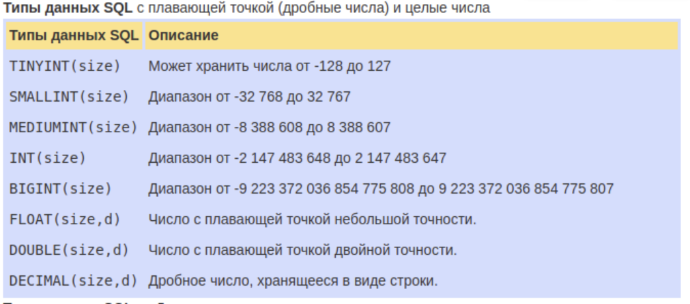

# **Базы данных, введение.**


**Базы данных (БД)** - это **организованная структура**, предназначенная       
для **хранения информации**. Обычно БД представляются в виде **совокупности**       
**взаимосвязанных файлов или таблиц**, предназначенных для решения         
конкретной задачи.


С понятием **БД** тесно связано понятие **системы управления базой данных**          
**(СУБД). СУБД** — это комплекс программных средств, предназначенных для          
создания **структуры новой базы, наполнения** ее содержимым,            
**редактирования** содержимого и **визуализации** информации.

---

# **В чём суть?**

Весь смысл использования **базы данных** в том, что когда данных становится          
больше, чем несколько книг в этом вашем экселе и эти данные внезапно становится          
невероятно **сложно структурировать**, а попытки получить полный список приводят            
среднестатистический компьютер в состояние синего экрана от нагрузки, то в дело            
вступают **СУБД**, которые берут на себя это нелегкое и весьма оплачиваемое             
со стороны крупных предприятий бремя.


**СУБД** освобождает разработчика от задач **хранения, модификации и поиска данных**.                
Его дело — **указать**, какие данные взять, и что с ними **сделать**.            
Все остальное сделает сама **СУБД**.


---

Основным элементом **БД** является **таблица**. Столбцы таблицы **БД** называются полями,               
а строки — **записями**. Первым этапом создания таблицы **БД** является              
**задание ее структуры**, т.е. **определение количества и типа полей**. Вторым этапом является           
ввод и редактирование записей в таблицу.          
БД считается созданной, даже если она пустая.


Поля таблицы просто **определяют ее структуру** и групповые свойства данных,            
записываемых в ячейках. Рассмотрим основные свойства полей БД.


* **Имя поля** — определяет как надо обращаться к данным поля (имена используются как заголовки таблиц).
* **Тип поля** — определяет тип данных, которые могут содержаться в данном поле (текстовые, числовые, дата, Memo, денежный, счетчик и др.).
* **Размер поля** — определяет предельную длину данных, которые могут размещаться в поле.
* **Формат поля** — способ форматирования данных в ячейках.

---

# **Типы таблиц и ключей в реляционных БД.**

Реляционные(табличные) базы данных характеризуются наличием некоторых          
типов таблиц и ключей, позволяющих определить отношения между таблицами.         


Для того чтобы понять принципы разработки реляционных баз данных,           
требуется дать определения различных типов реляционных ключей и таблиц:


* **Базовая таблица**. В реляционной базе данных **базовой таблицей** называется             
таблица, которая включает **один или несколько столбцов свойств объекта**           
**и содержит первичный ключ**, который однозначно определяет этот объект.           
Более того, базовая таблица должна содержать первичный ключ. Базовые таблицы            
часто называют первичными, поскольку они имеют первичный ключ.


* **Промежуточная таблица**. Таблица, **не являющаяся базовой**          
(т. к. она не объединяет свойства объекта или не содержит поле первичного ключа),           
которая **используется для обеспечения связей между другими таблицами**, называется          
**таблицей отношений**. Ключевые поля в таблицах отношений должны быть **внешними**            
**ключами**, связанными с **первичными ключами** базовой таблицы. Проще говоря,          
таблица отношений состоит только из **внешних ключей и не содержит независимых**       
**элементов** данных.


* **Первичный ключ**. Состоит из **набора значений, которые однозначно определяют**        
**запись базовой таблицы**. Любому значению первичного ключа должна соответствовать        
**одна и только одна строка таблицы**. **Первичный ключ** включает одно поле только        
в том случае, если это поле не содержит повторяющихся значений.


* **Составные ключи**. Если для выполнения условий, накладываемых на значения          
первичного ключа, заданный ключ включает несколько полей таблицы, то            
тогда он называется **составным**.


* **Внешние ключи**. **Внешний ключ** — это столбец, значения которого **соответствуют**         
**значениям первичного ключа** другой связанной таблицы.

---

# **SQL**

Устав от написания бесконечных процедур поиска, вставки, удаления, замены, программисты        
сообразили переложить эту обязанность на саму **СУБД**. Для этого они запилили **язык**         
**структурированных запросов (SQL)**. Итог очевиден — вместо тысячи строк кода пишется        
одна строка, которая сделает ровно то, о чем ее просили, а не то, что породил больной         
разум говнокодера. Плюсом — все изменения в базе данных выполняются одинаково,         
что позволяет при правильном администрировании легко и быстро восстановить исходное        
состояние при сбоях и ошибках.


Теоретически, **SQL** должен обеспечивать и **независимость от платформы**, возвращая       
один и тот же результат для **любой СУБД**, реализующей её. На практике каждый       
производитель **СУБД** добавляет в **SQL** свои, присущие только этой **СУБД** фишечки,            
чем усложняет работу программиста и разработчика **СУБД**, но это, конечно же,          
не мешает мамкиным PHP кодерам использовать ORM'ы, которые представляют из           
себя некую прослойку между грязным SQL и абстракциями высокого уровня,           
которая генерирует SQL вместо программиста и позволяет         
забить на особенности СУБД.

---

# **Разновидности**

Существует очень много разных **СУБД**, которые могут отличаться настолько, что не будут        
понимать **SQL** друг друга. Или вообще, не являться реляционными и, соответственно,         
не поддерживать **SQL** вовсе. Ниже приведены наиболее известные реляционные **СУБД**.


### **Oracle**

Огромная сложная махина, для работы с которой требуются админы 80 уровня с сертификатами,       
подготовка коих стоит с десяток килобаксов. Умеет делать все, вплоть до того, что может           
выступать движком для веб приложений ([APEX](https://apex.oracle.com/en/) называется). Работает на Unix, винде и еще            
черт знает чем. Стоит эпических деньжищ, так что, ее могут себе позволить только            
большие конторы, что у нас, что на Западе. ИЧСХ, если ты не собираешься на ней            
крутить производственную базу, а просто разрабатываешь приложения, изучаешь или играешься,           
то скачать и пользоваться ей можно абсолютно бесплатно, даже самой ентерпрайзной           
версией, что есть таки вин.


### **MS SQL Server**

**Microsoft** в свое время, в лучших своих традициях, подсуитилась и стырила **СУБД у Sybase**.         
С тех пор, как они заявляют, ее полностью переписали. **СУБД** получилась уровнем          
пониже **Oracle**, хотя, по этому поводу идут свои споры. Для управления **БД** используется           
почти исключительно **UI**, что несколько роднит эту систему с **Delphi**: вместо знания **DDL** тут             
нужно знать куда тыкнуть мышкой. Ну, есть еще **PowerShell**, но он никому не нужен. Раньше              
работал исключительно под Виндой, но начиная с 2016-й версии подружился с **Linux**.


### **PostgreSQL**

Этот ваш **open source** во всей своей силе. Была разработана в университете Беркли, откуда еще        
много чего повыходило. Древняя — **Ingres**, от которого произошел **PostgreSQL**          
(собственно, **Post Ingres**) начинал разрабатываться еще в начале 70-ых, когда этого вашего       
Oracle в проекте не было. Справедливости ради, следует заметить, что с изначальным       
Ingres'ом современный **Postgres** общего имеет почти что ничего, т.к. в конце 80-ых был         
практически полностью переделан. Довольно таки успешна, как для продукта столь древнего,       
достаточно быстро развивается, имеется большое количество сторонних приблуд.        
Ее уважают админы Oracle за то, что авторы не выеживались, а нормально следовали       
стандартам. Как и в случае многих других open source программ, очень хреново уживается с        
виндой.


### **MySQL**

Тоже **open source**, но более дикий и лохматый. Самая популярная база для создания веб-сайтов,        
входит в состав так называемого **LAMP (Linux, Apache, MySQL, PHP)**. Поддерживает несколько       
движков **СУБД**, из которых не все поддерживают транзакции **ACID** (движок MyISAM как раз такой).       
До 5-ой версии был объектом всеобщих насмешек из-за слабого функционала, неполноценной        
поддержки даже древних стандартов **SQL** и обилия крайне сомнительных и костыльных решений, во       
многом спровоцированных как раз таки возможностью использования нескольких движков.     
Нынче все стало сильно получше, но, как следствие, изрядно усложнилась настройка — по      
сложности тюнинга современные версии приближаются к **PostgreSQL**. Впрочем, ситуаций, когда        
такой тюнинг реально нужен — одна на миллион. Однако, по закону вселенской несправедливости,       
такая ситуация обязательно возникнет именно у тебя.


### **IBM DB2**

В свое время была весьма популярной и даже использовалась в качестве штатной **СУБД в Oracle**,         
однако в какой-то момент **IBM** откровенно забила на свое детище, в результате чего многие        
новомодные фишечки в нее попали сильно позже, чем у конкурентов. До сих пор где-то         
кем-то используется, но в сравнении с любой другой **СУБД** из данной статьи ее процент          
на рынке очень невелик.


### **SQLite**

Это не столько **СУБД**, сколько библиотека, которая позволяет хранить данные в файле,         
обращаясь в нему как к базе данных с помощью **SQL**. Там тоже можно создавать таблицы         
и индексы, выполнять **DML** и запросы. Удобно в случае, если не хочется возиться с       
**XML** или создавать свой формат файла. Ныне имеется практически в каждом телефоне,        
хотя далеко не всякий разработчик знает, что это именно **SQLite** прячется за        
привычными вызовами **Android-API**

---

# **SQL команды**

### **Типы данных**

---


---



---


---

### **Структура SQL запросов**

* **SELECT** ('столбцы или * для выбора всех столбцов; обязательно')
* **FROM** ('таблица; обязательно')
* **WHERE** ('условие/фильтрация, например, city = 'Minsk'; необязательно')
* **GROUP BY** ('столбец, по которому хотим сгруппировать данные; необязательно')
* **HAVING** ('условие/фильтрация на уровне сгруппированных данных; необязательно')
* **ORDER BY** ('столбец, по которому хотим отсортировать вывод; необязательно')


### **CREATE TABLE**

Для того, чтобы создать таблицу в **SQL**, используется выражение **CREATE TABLE**.      
Он принимает в качестве параметров все колонки, которые мы хотим внести,        
а также их типы данных.

Давайте создадим табличку с названием `"Months"`, в которой будет три колонки:

* **id** - иными словами, порядковый номер месяца (целочисленный тип или int)
* **name** - название месяца (строка или varchar(10) (10 символов - максимальная длина строки))
* **days** - число дней в конкретном месяце (целочисленный тип или int)

Код будет выглядеть вот так:

```sql
CREATE TABLE months (id int PRIMARY_KEY NOT NULL, name varchar(10), days int);
```

Также, когда создаются таблицы, принято добавлять так называемый **primary key**.       
Это колонка, значения в которой уникальны. Чаще всего **PK** колонкой        
является **id**, но в нашем случае это может быть и **name**, так как имена всех месяцев     
уникальны. Более подробно можно ознакомиться [здесь](https://www.w3schools.com/sql/sql_primarykey.asp).

### **INSERT**

**Ввод данных**. Теперь давайте добавим пару месяцев в нашу табличку. Сделать это       
можно с помощью команды **INSERT**.       

Есть два разных способа использовать **INSERT**:

1. Первый способ не подразумевает указания названий колонок, а лишь принимает       
значения в том порядке, в котором они указаны в таблице:

```sql
INSERT INTO months VALUES (1, 'January', 31)
```

Первый способ короче второго, однако если в будущем мы захотим        
добавить дополнительные колонки, все предыдущие запросы работать       
не будут. Для решения данной проблемы следует использовать         
второй способ. Его 

2. Суть в том, что перед вводом данных мы указываем названия колонок.     
В случае, если мы не укажем одну из колонок, на её место будет записано       
**NULL** или заданное значение по умолчанию, но это уже совсем другая история.

```sql
INSERT INTO months (id,name,days) VALUES (2,'February',29);
```

### **SELECT, FROM**

**SELECT, FROM** — обязательные элементы запроса, которые определяют        
выбранные столбцы, их порядок и источник данных.

```sql
SELECT * FROM months
```

Результатом данного запроса будет таблица со всеми данными в       
таблице **months**. Знак звёздочки (`*`) означает то, что мы хотим       
показать **все столбцы из таблицы без исключений**. Так как в базе данных        
обычно больше одной таблицы, нам необходимо указывать название         
таблицы, данные из которой мы хотим посмотреть. Сделать это мы можем,       
используя ключевое слово **FROM**.


Когда вам нужны лишь некоторые столбцы из таблицы, то вы можете      
указать их имена через запятую вместо звёздочки.

```sql
SELECT id, name FROM months
```

### **WHERE**

**WHERE** — необязательный элемент запроса, который используется, когда нужно      
**отфильтровать данные по нужному условию**. Очень часто внутри элемента **where**      
используются **IN / NOT IN** для фильтрации столбца по нескольким значениям, **AND / OR**       
для фильтрации таблицы по нескольким столбцам.


* **IN** - сравнивает значение в столбце с несколькими возможными значениями и возвращает     
**true**, если значение совпадает хотя бы с одним значением
* **BETWEEN** - проверяет, находится ли значение в каком-то промежутке
* **LIKE** - ищет по шаблону

Фильтрация по одному условию и одному значению:

```sql
SELECT * FROM Customers
WHERE City = 'London'
```

Фильтрация по одному условию и нескольким значениям с применением       
`IN (включение) или NOT IN (исключение)`:

```sql
SELECT * FROM Customers
WHERE City IN ('London', 'Berlin')
```

```sql
SELECT * FROM Customers
WHERE City NOT IN ('Madrid', 'Berlin','Bern') 
```


Фильтрация по нескольким условиям с применением AND (выполняются все условия)      
или OR (выполняется хотя бы одно условие) и нескольким значениям:

```sql
select * from Customers
where Country = 'Germany' AND City not in ('Berlin', 'Aachen') AND CustomerID > 15
```

```sql
select * from Customers
where City in ('London', 'Berlin') OR CustomerID > 4
```

```sql
SELECT * FROM Customers
WHERE name LIKE "%on"
```

### **GROUP BY**

**GROUP BY** — необязательный элемент запроса, с помощью которого можно         
задать агрегацию по нужному столбцу (например, если нужно узнать какое      
количество клиентов живет в каждом из городов).

При использовании GROUP BY обязательно:

1. перечень столбцов, по которым делается разрез, был одинаковым внутри     
SELECT и внутри GROUP BY 


2. агрегатные функции (SUM, AVG, COUNT, MAX, MIN)       
должны быть также указаны внутри SELECT с указанием столбца,       
к которому такая функция применяется.


В SQL полно встроенных функций для выполнения разных операций. Мы же покажем вам только       
наиболее часто используемые:


* **COUNT()** - возвращает число строк
* **SUM()** - возвращает сумму всех полей с числовыми значениями в них
* **AVG()** - возвращает среднее значение среди строк
* **MIN()/MAX()** - возвращает минимальное/максимальное значение среди строк


Группировка количества клиентов по городу:

```sql
select City, count(CustomerID) from Customers
GROUP BY City
```

Группировка количества клиентов по стране и городу:

```sql
select Country, City, count(CustomerID) from Customers
GROUP BY Country, City
```

Группировка продаж по ID товара с разными агрегатными функциями: количество заказов       
с данным товаром и количество проданных штук товара:

```sql
select ProductID, COUNT(OrderID), SUM(Quantity) from OrderDetails
GROUP BY ProductID
```

Группировка продаж с фильтрацией исходной таблицы. В данном случае на выходе будет       
таблица с количеством клиентов по городам Германии:

```sql
select City, count(CustomerID) from Customers
WHERE Country = 'Germany'
GROUP BY City
```

Переименование столбца с агрегацией с помощью оператора AS. По умолчанию название столбца       
с агрегацией равно примененной агрегатной функции, что далее может быть не        
очень удобно для восприятия.

```sql
select City, count(CustomerID) AS Number_of_clients from Customers
group by City
```

### **HAVING**

**HAVING** — необязательный элемент запроса, который отвечает за фильтрацию на уровне       
сгруппированных данных (по сути, **WHERE**, но только на уровень выше).


Фильтрация агрегированной таблицы с количеством клиентов по городам, в данном        
случае оставляем в выгрузке только те города, в которых не менее 5 клиентов:

```sql
select City, count(CustomerID) from Customers
group by City
HAVING count(CustomerID) >= 5
```

В случае с переименованным столбцом внутри **HAVING** можно указать как и саму агрегирующую        
конструкцию **count(CustomerID)**, так и новое название столбца **number_of_clients**:

```sql
select City, count(CustomerID) as number_of_clients from Customers
group by City
HAVING number_of_clients >= 5
```

Пример запроса, содержащего **WHERE** и **HAVING**. В данном запросе сначала фильтруется исходная        
таблица по пользователям, рассчитывается количество клиентов по городам и остаются        
только те города, где количество клиентов не менее 5:

```sql
select City, count(CustomerID) as number_of_clients from Customers
WHERE CustomerName not in ('Around the Horn','Drachenblut Delikatessend')
group by City
HAVING number_of_clients >= 5
```

### **ORDER BY**

**ORDER BY** — необязательный элемент запроса, который отвечает за сортировку таблицы.

Простой пример сортировки по одному столбцу. В данном запросе осуществляется сортировка      
по городу, который указал клиент:

```sql
select * from Customers
ORDER BY City
```

Осуществлять сортировку можно и по нескольким столбцам, в этом случае сортировка       
происходит по порядку указанных столбцов:

```sql
select * from Customers
ORDER BY Country, City
```

По умолчанию сортировка происходит по возрастанию для чисел и в алфавитном порядке для        
текстовых значений. Если нужна обратная сортировка, то в конструкции **ORDER BY**       
после названия столбца надо добавить **DESC**:

```sql
select * from Customers
order by CustomerID DESC
```

Обратная сортировка по одному столбцу и сортировка по умолчанию по второму:

```sql
select * from Customers
order by Country DESC, City
```

### **JOIN**

**JOIN** — необязательный элемент, используется для объединения таблиц по ключу,      
который присутствует в обеих таблицах. Перед ключом ставится оператор **ON**.


Запрос, в котором соединяем таблицы **Order** и **Customer** по ключу **CustomerID**, при этом     
перед названиям столбца ключа добавляется название таблицы через точку:

```sql
select * from Orders
JOIN Customers ON Orders.CustomerID = Customers.CustomerID
```

Нередко может возникать ситуация, когда надо промэппить одну таблицу значениями из другой.       
В зависимости от задачи, могут использоваться разные типы присоединений.      


**INNER JOIN** — пересечение, **RIGHT/LEFT JOIN** для мэппинга одной таблицы значениями из другой,

```sql
select * from Orders
join Customers on Orders.CustomerID = Customers.CustomerID
where Customers.CustomerID >10
```

Внутри всего запроса **JOIN** встраивается после элемента **from** до элемента **where**, пример запроса:


Другие типы JOIN'ов можно увидеть на замечательной картинке ниже

---


---

В сложных базах данных чаще всего у нас есть несколько связанных таблиц.       
К примеру, у нас есть две таблицы: про видеоигры и про разработчиков.


В таблице **video_games** есть столбец **developer_id**, в данном случае он является так     
называемым **foreign_key**. Чтобы было проще понять, **developer_id** - это        
связывающее звено между двумя таблицами.


Если мы хотим вывести всю информацию об игре, включая информацию       
о её разработчике, нам необходимо подключить вторую таблицу.        
Чтобы это сделать, можно использовать **INNER JOIN**:

```sql
SELECT video_games.name, video_games.genre, game_developers.name, game_developers.country
FROM video_games
INNER JOIN game_developers
ON video_games.developer_id = game_developers.id;
```

### **AS**

**Псевдонимы**. Если вы взгляните на предыдущий пример, то вы заметите, что есть два        
столбца, названных одинаково: **"name"**. Часто это может запутать. Решением данной       
проблемы являются псевдонимы. Они, к слову, помогают сделать название       
столбца красивее или понятнее в случае необходимости.

Чтобы присвоить столбцу псевдоним, можно использовать ключевое слово **AS**:

```sql
SELECT games.name, games.genre, devs.name AS developer, devs.country
FROM video_games AS games
INNER JOIN game_developers AS devs
ON games.developer_id = devs.id;
```

### **UPDATE**

Зачастую нам нужно изменить данные в таблице. В **SQL** это делается с помощью **UPDATE**.


Использование UPDATE включает в себя:

* выбор таблицы в которой находится поле, которое мы хотим изменить
* запись нового значения
* использование **WHERE**, чтобы обозначить конкретное место в таблице


Предположим, у нас есть таблица с самыми высокооценёнными сериалами всех времён.      
Однако у нас есть проблема: «Игра Престолов» обозначена как комедия и нам      
определённо нужно это изменить:

```sql
UPDATE tv_series
SET genre = 'drama'
WHERE name = 'Game of Thrones';
```

### **DELETE**

**Удаление записей из таблицы**
Удаление записи из таблицы через **SQL** - очень простая операция.       
Всё, что нужно - это обозначить, что именно мы хотим удалить.

```sql
DELETE FROM tv_series
WHERE id = 4;
```

### Примечание: убедитесь, что используете **WHERE**, когда удаляете запись из таблицы.       
### Иначе вы удалите все записи из таблицы, сами того не желая.

### **TRUNCATE**

**Удаление таблиц**

Если мы хотим удалить все данные из таблицы, но при этом оставить саму таблицу,       
нам следует использовать команду **TRUNCATE**:

```sql
TRUNCATE TABLE table_name;
```

### **DROP**

В случае, если мы хотим удалить саму таблицу, то нам следует использовать команду **DROP**:

```sql
DROP TABLE table_name;
```

---

# **SQL Инъекции**

**SQL-инъекция** — это атака, направленная на веб-приложение, в ходе которой     
конструируется **SQL-выражение** из пользовательского ввода путем простой       
**конкатенации** (например, **$query="SELECT * FROM users WHERE id="**. ...)       
В случае успеха атакующий может изменить логику выполнения **SQL-запроса**        
так, как это ему нужно