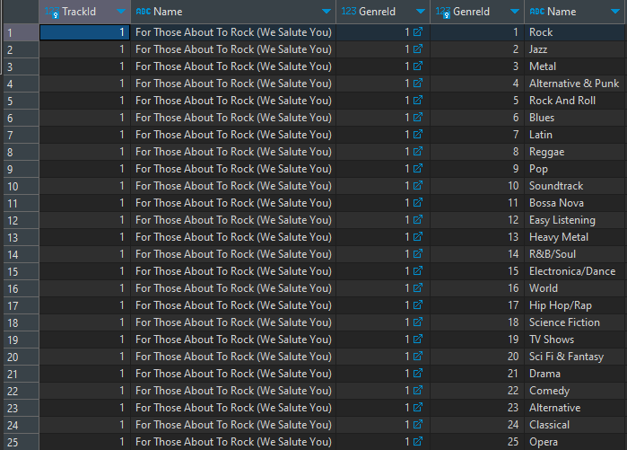
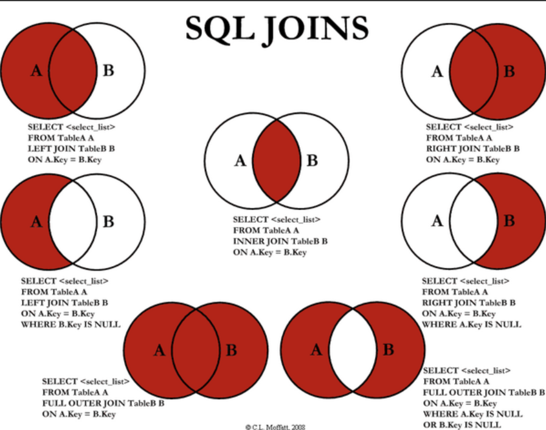

# **Queries Language**

# **sql** - Structured Queries Language

# **DDL**

* **DDL (Data Definition Language)** в **SQL (Structured Query Language)**      
используется для определения и управления структурой БД. Он позволяет        
создавать, изменять и удалять объекты БД, такие как таблицы, индексы,      
представления и т.д.       

Один из примеров создания таких запросов - создание объектов (таблицы,        
представления, индексы):     


Создание новой базы данных:

```sql
CREATE DATABASE social_media;
```
Создание новой таблицы:

```sql
CREATE TABLE users (
    id INT primary key auto_increment NOT NULL,
    name VARCHAR(15),
    surname VARCHAR(20),
    age INT,
    phone VARCHAR(25),
    email VARCHAR(35)
);
```

Так же, если в какой-то момент вам нужно добавить новое поле(колонку)        
в вашу таблицу (поменялось ТЗ, забыли добавить и т.д.) - есть следующий       
синтаксис:

```sql
ALTER TABLE users ADD COLUMN created_at DATETIME;
```

Так же существует возможность добавлять новую колонку не в конец таблицы     
(по умолчанию), а в определённое место:

```sql
ALTER TABLE users ADD COLUMN phone VARCHAR(20) AFTER age;
```

Так делать - не самое лучшее решение, так как некоторые уже существующие запросы        
могут полететь из-за новой структуры таблицы.

Ещё более опасная команда (для джуна) - **DROP**

```sql
DROP TABLE users;
```

Такая команда полностью удалит указанную таблицу (структура и содержимое)

Как проходили на прошлом занятии - можно проиндексировать определённое поле в      
таблице, что значительно может ускорить выполнение запросов на поиск (но замедлит     
запись, обратная медаль, все дела.)

```sql
CREATE INDEX idx_users_name ON users(name);
```

---

# **DML**

**DML (Data Manipulation Language)** в **SQL (Structured Query Language)**       
используется для манипуляции данными в БД. Он включает запросы для         
добавления, изменения и удаления данных.          

* **INSERT INTO** - добавление новых данных в определённую таблицу.

```sql
INSERT INTO users (name, surname, age, phone, email, created_at) VALUES
("John", "Smith", 30, "555-1234", "john.smith@example.com", "2023-07-16 12:34:56"),
("Alice", "Johnson", 25, "555-5678", "alice.johnson@example.com", "2023-07-16 13:45:12"),
("Michael", "Brown", 40, "555-9876", "michael.brown@example.com", "2023-07-16 14:23:18"),
("Emily", "Williams", 28, "555-4321", "emily.williams@example.com", "2023-07-16 15:10:24"),
("Daniel", "Jones", 33, "555-8765", "daniel.jones@example.com", "2023-07-16 16:55:30"),
("Sophia", "Davis", 22, "555-3456", "sophia.davis@example.com", "2023-07-16 17:42:36"),
("Matthew", "Miller", 29, "555-7654", "matthew.miller@example.com", "2023-07-16 18:30:42"),
("Olivia", "Wilson", 27, "555-2345", "olivia.wilson@example.com", "2023-07-16 19:15:48"),
("James", "Taylor", 35, "555-6543", "james.taylor@example.com", "2023-07-16 20:20:54"),
("Ava", "Anderson", 31, "555-5432", "ava.anderson@example.com", "2023-07-16 21:12:00"),
("William", "Thomas", 37, "555-3456", "william.thomas@example.com", "2023-07-16 22:08:06"),
("Isabella", "Martinez", 24, "555-8765", "isabella.martinez@example.com", "2023-07-16 23:02:12"),
("Liam", "Garcia", 26, "555-6543", "liam.garcia@example.com", "2023-07-17 00:17:18"),
("Emma", "Robinson", 23, "555-4321", "emma.robinson@example.com", "2023-07-17 01:21:24"),
("Noah", "Clark", 32, "555-7654", "noah.clark@example.com", "2023-07-17 02:35:30"),
("Sophia", "Lewis", 28, "555-2345", "sophia.lewis@example.com", "2023-07-17 03:49:36"),
("Liam", "Lee", 36, "555-5432", "liam.lee@example.com", "2023-07-17 04:53:42"),
("Olivia", "Walker", 30, "555-9876", "olivia.walker@example.com", "2023-07-17 05:08:48"),
("Noah", "Hall", 29, "555-1234", "noah.hall@example.com", "2023-07-17 06:27:54"),
("Ava", "Allen", 25, "555-8765", "ava.allen@example.com", "2023-07-17 07:30:00"),
("James", "Young", 34, "555-6543", "james.young@example.com", "2023-07-17 08:42:06"),
("Isabella", "Hernandez", 27, "555-5432", "isabella.hernandez@example.com", "2023-07-17 09:55:12"),
("William", "King", 33, "555-2345", "william.king@example.com", "2023-07-17 10:11:18"),
("Emma", "Wright", 26, "555-9876", "emma.wright@example.com", "2023-07-17 11:24:24"),
("Oliver", "Lopez", 31, "555-1234", "oliver.lopez@example.com", "2023-07-17 12:32:30"),
("Sophia", "Hill", 29, "555-7654", "sophia.hill@example.com", "2023-07-17 13:50:36"),
("Noah", "Scott", 22, "555-5432", "noah.scott@example.com", "2023-07-17 14:58:42"),
("Olivia", "Green", 35, "555-8765", "olivia.green@example.com", "2023-07-17 15:10:48"),
("Liam", "Adams", 27, "555-2345", "liam.adams@example.com", "2023-07-17 16:23:54"),
("Ava", "Baker", 33, "555-6543", "ava.baker@example.com", "2023-07-17 17:38:00"),
("William", "Carter", 28, "555-5432", "william.carter@example.com", "2023-07-17 18:50:06"),
("Isabella", "Rivera", 30, "555-1234", "isabella.rivera@example.com", "2023-07-17 19:03:12"),
("Oliver", "Adams", 24, "555-8765", "oliver.adams@example.com", "2023-07-17 20:15:18"),
("Emma", "Butler", 32, "555-7654", "emma.butler@example.com", "2023-07-17 21:22:24"),
("Olivia", "Perez", 26, "555-5432", "olivia.perez@example.com", "2023-07-17 22:30:30"),
("Liam", "Parker", 29, "555-2345", "liam.parker@example.com", "2023-07-17 23:42:36"),
("Oliver", "Cruz", 33, "555-8765", "oliver.cruz@example.com", "2023-07-18 00:55:42"),
("Emma", "Reed", 28, "555-7654", "emma.reed@example.com", "2023-07-18 01:10:48"),
("Olivia", "Roberts", 27, "555-2345", "olivia.roberts@example.com", "2023-07-18 02:22:54"),
("Liam", "Stewart", 30, "555-5432", "liam.stewart@example.com", "2023-07-18 03:38:00"),
("Oliver", "Morales", 31, "555-1234", "oliver.morales@example.com", "2023-07-18 04:51:06"),
("Emma", "Cooper", 25, "555-8765", "emma.cooper@example.com", "2023-07-18 05:03:12"),
("Olivia", "Hill", 29, "555-6543", "olivia.hill@example.com", "2023-07-18 06:15:18"),
("Liam", "Lee", 33, "555-9876", "liam.lee@example.com", "2023-07-18 07:22:24"),
("Oliver", "Morgan", 26, "555-2345", "oliver.morgan@example.com", "2023-07-18 08:30:30"),
("Emma", "Bailey", 30, "555-5432", "emma.bailey@example.com", "2023-07-18 09:45:36"),
("Olivia", "Cox", 28, "555-8765", "olivia.cox@example.com", "2023-07-18 10:58:42"),
("Liam", "Rogers", 32, "555-6543", "liam.rogers@example.com", "2023-07-18 11:05:48"),
("Oliver", "Ward", 24, "555-2345", "oliver.ward@example.com", "2023-07-18 12:18:54"),
("Emma", "Hayes", 27, "555-9876", "emma.hayes@example.com", "2023-07-18 13:30:00")                                                               
```

Так же можно изменять данные в определённой колонке и таблице (обновлять их)     
но для этого в обязательном порядке указывайте через **WHERE** в какой конкретной       
записи сделать апдейт, иначе обновится всё.....

```sql
UPDATE users SET phone = '45612387489' WHERE id = 1;
```

Абсолютно так же работает для удаления данных из таблицы. Просто указываете       
ID записи, которую хотите удалить.

```sql
DELETE FROM users WHERE id = 1;
```


### **SOFT DELETE**

Очень важный и до безумия полезный приём при разных удалениях (данных \ таблиц)    
**Мягкое удаление**

Способ, при котором в таблицу добавляется спец поле типа **deleted**, которое по дефолту     
будет равно false. В момент необходимости "удаления" записи значение в этом поле         
просто ставится на **true** и в дальнейших выборках будут применены фильтры на отображение       
только тех записей, у которых это поле всё ещё false.    
Таким образом клиент данных не видит, но при этом в базе они есть.      


```sql
alter table users add column deleted BOOL default false;
```

**TRUNCATE TABLE** - удаление записей из таблицы с сохранением структуры самой таблицы.       


---


# **Создание связей таблиц**

Собсна мы на примере создания таблиц уже узнали, что у нас должно быть как минимум одно      
уникальное поле, которое по дефолту идёт как id записи. Такое действие мы можем провернуть        
благодаря команде **PRIMARY KEY**. Так же зачастую для настройки этого поля используются такие      
настройки, как **AUTO_INKREMENT, NOT NULL**

Такие дефолтные таблицы называются **Родительскими**

Так же мы можем связывать таблицы между собой, создавая и **Дочерние** таблицы, одно из полей         
которой будет ссылаться на уникальное поле родительской таблицы:

```sql
CREATE TABLE posts (
  id INT PRIMARY KEY AUTO_INCREMENT NOT NULL,
  user_id INT,
  name VARCHAR(50),
  description TEXT(500),
  created_at DATETIME,
  deleted BOOL DEFAULT false,
  FOREIGN KEY(user_id) REFERENCES users(id)
);
```

```sql
CREATE TABLE comments (
    id INT PRIMARY KEY AUTO_INCREMENT NOT NULL,
    user_id INT,
    post_id INT,
    description TEXT(300),
    created_at DATETIME,
    deleted BOOL DEFAULT false,
    FOREIGN KEY(user_id) REFERENCES users(id),
    FOREIGN KEY(post_id) REFERENCES posts(id)
);
```

В конце запроса мы можем указать ссылки наших полей на колонки определённой родительской таблицы       
через команду **FOREIGN KEY()** мы указываем какое поле из текущей таблицы хотим привязать, а       
благодаря команде **references** мы указываем уже в какой таблице к какому полю мы подвязываемся.       

### **Many to many tables**
Так же, когда нам нужна связь **many to many**, мы должны создать так называемую **ассоциативную**        
или как её ещё называют **связную** таблицу. Её суть заключается в хранении ID записей из двух таблиц,       
между которыми образуется связь **many to many**. Название такой таблицы зачастую состоит из сложения         
имён двух этих таблиц:

```sql
CREATE TABLE posts_comments (
    id INT PRIMARY KEY AUTO_INCREMENT NOT NULL,
    post_id INT,
    comment_id INT,
    FOREIGN KEY(post_id) REFERENCES posts(id),
    FOREIGN KEY(comment_id) REFERENCES comments(id)
);
```

---

# **WHERE in SQL**

Оператор **WHERE** в **SQL** используется для фильтрации результатов       
запроса на основе заданных условий. Он позволяет выбирать строки из         
таблицы, которые удовлетворяют определенным критериям         

По синтаксису всё достаточно просто:

```sql
SELECT your, columns, via, comma
FROM required_table
WHERE condition
```

#### **Распространённые условия**

* **Сравнительные операторы:** '=', '>', '<', '>=', '<=', '<>', '!='


* **Логические операторы:** AND, OR, NOT


* **BETWEEN:** определяет диапазон значений


* **IN**: проверяет, соответствует ли значение списку значений


* **LIKE**: используется для сопоставления строк с шаблоном


* **IS NULL**: проверяет, является ли значение NULL


### **Комбинирование условий**

Можно комбинировать несколько условий с помощью логических       
операторов AND и OR для создания более сложных условий фильтрации.       
Круглые скобки могут использоваться для явного определения порядка       
операций.         

**Примеры использования:**


Показать только тех пользователей, которые младше 30-ки.

```sql
SELECT *
FROM users
WHERE age < 30;
```

```sql
SELECT *
FROM users
WHERE age <= 30
AND name LIKE 'J%';
```

Допустим у нас улетело n пользователей, их нужно             
"дропнуть" для клиента (через мягкое удаление):

```sql
UPDATE users SET deleted = true
WHERE id BETWEEN 11 AND 30;
```

И потом нам прилетел запрос показать всех зарегистрированных пользователей,         
чьё имя начинается или с "J", или с "S":

```sql
SELECT *
FROM users
WHERE deleted = false
AND (
	name LIKE 'J%'
	or name like 'S%'
);
```

Оператор **WHERE** - это мощный инструмент для фильтрации данных в      
SQL, он позволяет выбирать только необходимые строки,     
удовлетворяющие определённым условиям.      


---

# **LIKE**

Собсна, оператор **LIKE**

Оператор **LIKE** в **SQL** используется для сопоставления строк с шаблоном.       
Он обычно применяется в операторе WHERE для фильтрации результатов       
запроса на основе определенных паттернов соответствия.       

**Возможные шаблоны:**

* **%**: Заменяет любое количество символов (включая ноль символов).


* **_**: Заменяет один символ.


* **[]**: Определяет диапазон символов, которые могут совпадать.


* **[^]**: Определяет диапазон символов, которые не должны совпадать.

---

# **Запросы с функциями**

**Запросы с функциями в SQL** позволяют выполнять различные операции и       
вычисления над данными в базе данных.         

**Разновидности функций:**

* **COUNT()** используется для подсчета количества строк или
значений в столбце.


* **SUM()** используется для вычисления суммы значений в
столбце.


* **AVG()** используется для вычисления среднего значения в
столбце.


* **MAX()** используется для нахождения максимального значения
в столбце.


* **MIN()** используется для нахождения минимального значения в
столбце.


**Другие функции:**


В **SQL** также существует множество других функций: 

* **для работы со строками** (SUBSTRING, CONCAT, UPPER, LOWER и т.д.) 


* **функции даты и времени** (DATE, NOW, YEAR, MONTH, и т.д.)


* **функции математических операций** (ROUND, ABS, и т.д.)

**Прымерчыки:**

Оч нужно вывести кол-во всех юзеров(активных):

```sql
SELECT COUNT(*) AS users_count
FROM users
WHERE deleted = false;
```

Вывести средний возраст юзеров(активных) по палате:

```sql
SELECT AVG(age) AS mean_users_age
FROM users
WHERE deleted = false;
```

Почти так же и с самым младшим и самым старшим :)


---

# **JOIN**

Эт всё здорово конечно, что мы можем теперь создавать таблицы, устанавливать       
связи между ними, манипулировать данными как-то.

Но шо да как, когда мы хотим работать с данными из нескольких таблиц сразу?      

Вопросов нет, мы можем забирать всё и вся из нужных нам таблиц:


```sql
SELECT *
FROM users, comments, posts;
```

Но:

1. Это очень неудобно и на выходе мы получим много идентичных полей, которые нам         
не нужны от слова совсем.
2. Наши таблицы при таком "подходе" слипнутся в одну. Слипнутся они по ID.       
По факту между этими таблицами в подобной записи не будет никакой связи.         

Попробуем сделать такой "плохой" запрос на уже существующую, тестовую базу        
в программе DBeaver:

```sql
SELECT
    t.TrackId,
    t.Name,
    t.GenreId,
    g.GenreId,
    g.Name
FROM Track AS t, Genre AS g
LIMIT 25;
```

Если посмотреть на результат - это непонятная дичь:

---



---

Всё слепилось, наш id треков везде один и тот же, название треков тупо продублировалось      
id жанров "пляшут" как хотят у нас так же должен был вернуться только жанр        
"Rock", а вернулись полностью все доступные, ну просто фу, и ничего        
не понятно при этом.


Как же делать более этично и правильно? Мы должны "привязать" наши таблицы по их PK и FK


```sql
SELECT
    t.TrackId,
    t.Name,
    t.GenreId,
    g.GenreId,
    g.Name
FROM Track AS t
JOIN Genre AS g ON t.GenreId = g.GenreId
LIMIT 25;
```

В таком случае мы получим правильный ответ:

---


---

ID сопоставлены правильно, как нужно, названия треков не дублируются,       
наши с вами ID жанров не пошли по одному месту и при этом название жанров       
совпадает с тем, что мы ожидали.       

Если вдруг нам нужно взять дополнительно ещё одну таблицу для данных - без        
проблем!

```sql
SELECT 
    t.TrackId,
    t.Name AS track_name,
    a.title AS album_name,
    g.Name AS genre_name
FROM Track AS t
JOIN Genre AS g ON t.GenreId = g.GenreId
JOIN Album AS a ON t.AlbumId = a.AlbumId;
```

Вопрос: как мне дополнительно вывести данные из таблицы, id которого нет в моих      
треках? (например ArtistId)

```sql
SELECT 
    t.TrackId,
    t.Name AS track_name,
    a.title AS album_name,
    ar.Name AS artist_name,
    g.Name AS genre_name
FROM Track AS t
JOIN Genre AS g ON t.GenreId = g.GenreId
JOIN Album AS a ON t.AlbumId = a.AlbumId
JOIN Artist AS ar ON a.ArtistId = ar.ArtistId;
```


Для чего нам вообще нужны JOIN и в целом зачем нам так дробить все эти данные на           
большое кол-во разных таблиц?     

Всё достаточно просто: если мы будем пилить все схожие данные в одну таблицу (все       
возможные данные о песне), то такая таблица будет достаточно большой, а многие         
данные могут дублироваться, что не есть хорошо.

Для этого данные дробятся на разные таблицы, в зависимости от типа информации и        
получить что-то дополнительно мы можем как раз благодаря нашим объединениям таблиц      
**JOIN**


Собственно разновидностей объединений есть достаточно много, о них периодически спрашивают     
на собесах

вот вам небольшая схемка с вариациями JOIN и что они делают:


---




---

**Разновидности JOIN:**

1. **INNER JOIN (Внутреннее объединение):**
**INNER JOIN** возвращает только те строки, которые имеют совпадающие значения в        
обеих таблицах. Он объединяет строки из первой таблицы с соответствующими        
строками из второй таблицы, исключая все несовпадающие строки.        

```sql
SELECT orders.order_id, customers.customer_name
FROM orders
INNER JOIN customers ON orders.customer_id = customers.customer_id;
```

2. **LEFT JOIN (Левое объединение):**
**LEFT JOIN** возвращает все строки из левой таблицы и соответствующие строки       
из правой таблицы. Если в правой таблице нет соответствующих строк, то в        
результате будут показаны **NULL** значения.     

```sql
SELECT customers.customer_id, orders.order_id
FROM customers
LEFT JOIN orders ON customers.customer_id = orders.customer_id;

```

3. **RIGHT JOIN (Правое объединение):**
**RIGHT JOIN** работает аналогично **LEFT JOIN**, но возвращает все строки из      
правой таблицы и соответствующие строки из левой таблицы. Если в левой        
таблице нет соответствующих строк, то будут показаны **NULL** значения.

```sql
SELECT orders.order_id, customers.customer_name
FROM orders
RIGHT JOIN customers ON orders.customer_id = customers.customer_id;
```

4. **FULL JOIN (Полное объединение):**
**FULL JOIN** объединяет все строки из обеих таблиц, показывая соответствующие       
значения, если они есть, и дополняя отсутствующие значения **NULL**.

```sql
SELECT customers.customer_id, orders.order_id
FROM customers
FULL JOIN orders ON customers.customer_id = orders.customer_id;
```

5. **CROSS JOIN (Декартово произведение):**
**CROSS JOIN** производит комбинацию каждой строки из первой таблицы со       
всеми строками из второй таблицы. Это создает декартово произведение всех       
строк из обеих таблиц. Если первая таблица содержит **M** строк, а        
вторая таблица содержит **N** строк, то результат будет      
содержать **M * N** строк.

```sql
SELECT customers.customer_name, products.product_name
FROM customers
CROSS JOIN products;
```

6. **FULL OUTER JOIN (Полное внешнее объединение):**
**FULL OUTER JOIN** объединяет все строки из обеих таблиц и возвращает       
соответствующие значения, если они есть, и дополняет отсутствующие        
значения **NULL**. Таким образом, он включает результаты из обеих       
таблиц, включая строки, которые не имеют совпадений в другой таблице.

```sql
SELECT customers.customer_name, orders.order_id
FROM customers
FULL OUTER JOIN orders ON customers.customer_id = orders.customer_id;
```

7. **LEFT OUTER JOIN (Левое внешнее объединение):**
**LEFT OUTER JOIN** возвращает все строки из левой (первой) таблицы и соответствующие       
строки из правой (второй) таблицы. Если в правой таблице нет соответствующих строк,       
то в результирующем наборе данных будут показаны **NULL** значения для столбцов из        
правой таблицы. Левое объединение включает все строки из левой таблицы и только     
совпадающие строки из правой таблицы.      

```sql
SELECT customers.customer_id, orders.order_id
FROM customers
LEFT OUTER JOIN orders ON customers.customer_id = orders.customer_id;
```

8. **RIGHT OUTER JOIN (Правое внешнее объединение):**
**RIGHT OUTER JOIN** работает аналогично **LEFT OUTER JOIN**, но возвращает все строки      
из правой (второй) таблицы и соответствующие строки из левой (первой) таблицы.        
Если в левой таблице нет соответствующих строк, то будут показаны **NULL** значения       
для столбцов из левой таблицы. Правое объединение включает все строки из правой         
таблицы и только совпадающие строки из левой таблицы.

```sql
SELECT orders.order_id, customers.customer_name
FROM orders
RIGHT OUTER JOIN customers ON orders.customer_id = customers.customer_id;
```

9. **UNION JOIN (Объединение результатов):**
**UNION JOIN** не является стандартным типом **JOIN**. Вместо этого, он используется для объединения       
результатов двух или более **SELECT-запросов** в один результат. Он объединяет строки из всех        
запросов, удаляет дубликаты и возвращает единый набор данных.     

```sql
SELECT customer_id, customer_name
FROM customers
UNION
SELECT supplier_id, supplier_name
FROM suppliers;
```

