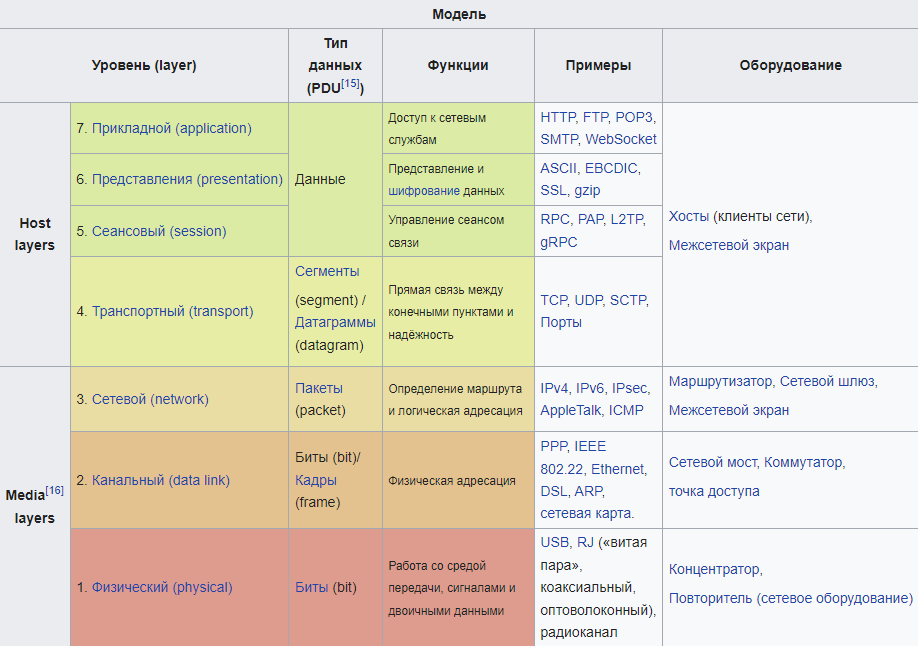
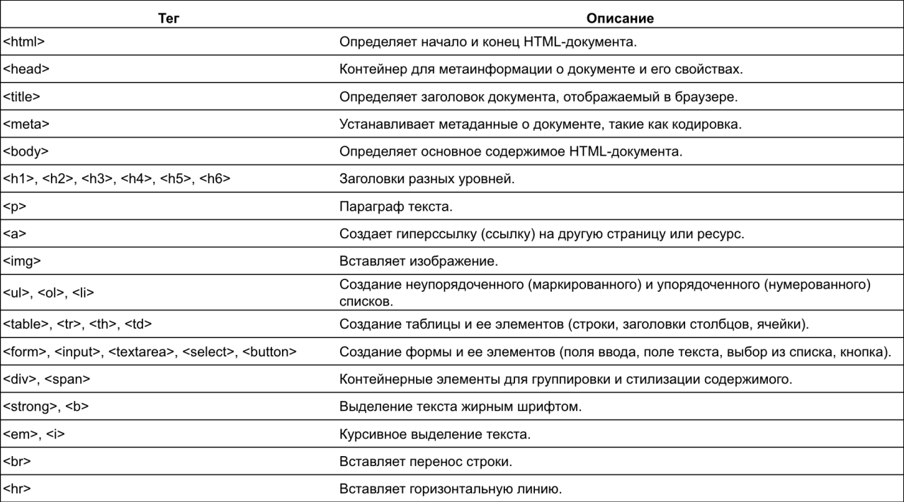
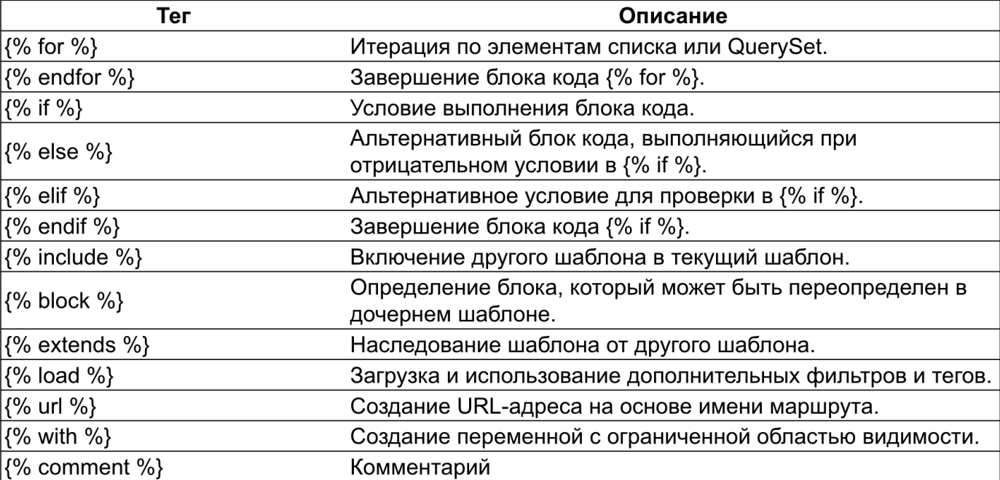

# **Представления, Шаблоны, Формы**

## **HTTP**

Давайте сперва поговорим о таких штуках, как модель передачи         
данных.

Есть такая штука, как сетевая модель **OSI(Open Systems Interconnection)**          
Посредством данной модели различные сетевые устройства могут          
взаимодействовать друг с другом. Модель определяет различные          
уровни взаимодействия систем. Каждый уровень выполняет           
определённые функции при таком взаимодействии.

Существует 7 видов уровней такой модели:

1) **Физический уровень**
2) **Канальный уровень**
3) **Сетевой уровень**
4) **Транспортный уровень**
5) **Сеансовый уровень**
6) **Уровень представления**
7) **Прикладной уровень**




---

### **Физический уровень**

Физический уровень (physical layer) — нижний уровень модели,         
который определяет метод передачи данных, представленных в двоичном виде,         
от одного устройства (компьютера) к другому.

Функции физического уровня реализуются на всех устройствах, подключенных       
к сети. Со стороны компьютера функции физического уровня выполняются сетевым        
адаптером или последовательным портом. К физическому уровню относятся          
физические, электрические и механические интерфейсы между двумя системами.


### **Канальный уровень**

Канальный уровень (data link layer) предназначен для обеспечения          
взаимодействия сетей на физическом уровне и контроля ошибок, которые могут          
возникнуть. Полученные с физического уровня данные, представленные в битах,          
он упаковывает в кадры, проверяет их на целостность и, если нужно,          
исправляет ошибки (либо формирует повторный запрос повреждённого кадра) и            
отправляет на сетевой уровень. 

Канальный уровень может взаимодействовать с одним или несколькими физическими      
уровнями, контролируя и управляя этим взаимодействием.


### **Сетевой уровень**

Сетевой уровень (network layer) модели предназначен для определения пути        
передачи данных. Отвечает за трансляцию логических адресов и имён в физические,       
определение кратчайших маршрутов, коммутацию и маршрутизацию, отслеживание      
неполадок и «заторов» в сети.

Протоколы сетевого уровня маршрутизируют данные от источника к получателю.       
Работающие на этом уровне устройства (маршрутизаторы) условно называют         
устройствами третьего уровня (по номеру уровня в модели OSI).


### **Транспортный уровень**

Транспортный уровень (transport layer) модели предназначен для обеспечения       
надёжной передачи данных от отправителя к получателю. При этом уровень        
надёжности может варьироваться в широких пределах. Существует множество классов      
протоколов транспортного уровня, начиная от протоколов, предоставляющих       
только основные транспортные функции (например, функции передачи данных без       
подтверждения приёма), и заканчивая протоколами, которые гарантируют доставку       
в пункт назначения нескольких пакетов данных в надлежащей последовательности,        
мультиплексируют несколько потоков данных, обеспечивают механизм управления      
потоками данных и гарантируют достоверность принятых данных. 

**UDP** ограничивается контролем целостности данных в рамках одной датаграммы        
и не исключает возможности потери пакета целиком или дублирования пакетов,       
нарушение порядка получения пакетов данных;          

**TCP** обеспечивает надёжную непрерывную передачу данных, исключающую потерю      
данных или нарушение порядка их поступления или дублирования, может       
перераспределять данные, разбивая большие порции данных на фрагменты и       
наоборот, склеивая фрагменты в один пакет.


### **Сеансовый уровень**

Сеансовый уровень (session layer) модели обеспечивает поддержание сеанса      
связи, позволяя приложениям взаимодействовать между собой длительное время.      
Уровень управляет созданием/завершением сеанса, обменом информацией,       
синхронизацией задач, определением права на передачу данных и поддержанием         
сеанса в периоды неактивности приложений.


### **Уровень представления**

Уровень представления (англ. presentation layer) обеспечивает преобразование       
протоколов и кодирование/декодирование данных. Запросы приложений, полученные      
с прикладного уровня, на уровне представления преобразуются в формат для        
передачи по сети, а полученные из сети данные преобразуются в формат приложений.     
На этом уровне может осуществляться сжатие/распаковка или шифрование/дешифрование,      
а также перенаправление запросов другому сетевому ресурсу, если они не могут       
быть обработаны локально.

Уровень представлений обычно представляет собой промежуточный протокол        
для преобразования информации из соседних уровней. Это позволяет осуществлять        
обмен между приложениями на разнородных компьютерных системах прозрачным для       
приложений образом. Уровень представлений обеспечивает форматирование и      
преобразование кода. Форматирование кода используется для того, чтобы        
гарантировать приложению поступление информации для обработки, которая имела      
бы для него смысл. При необходимости этот уровень может выполнять перевод из      
одного формата данных в другой.

Уровень представлений имеет дело не только с форматами и представлением        
данных, он также занимается структурами данных, которые используются       
программами. Таким образом, уровень 6 обеспечивает организацию данных при       
их пересылке.


### **Прикладной уровень**

Прикладной уровень (application layer) — верхний уровень модели, обеспечивающий        
взаимодействие пользовательских приложений с сетью:

* позволяет приложениям использовать сетевые службы:
    * удалённый доступ к файлам и базам данных
    * пересылка электронной почты
* отвечает за передачу служебной информации
* предоставляет приложениям информацию об ошибках
* формирует запросы к уровню представления


Протоколы прикладного уровня: RDP, HTTP, SMTP, SNMP, POP3, FTP, XMPP, OSCAR,         
Modbus, SIP, TELNET и другие.

---

Нас во всём этом деле интересует исключительно прикладной уровень, протокол HTTP         


**HTTP** - это протокол прикладного уровня сети, который используется для обмена             
данными клиента и сервера в сети. Он определяет формат сообщений и           
правила взаимодействия между клиентом и сервером.  **HTTP-протокол** работает на        
основе модели запрос-ответ. Клиент отправляет запрос серверу, сервер обрабатывает      
и отвечает на этот запрос и отсылает **HTTP-ответ**. Такая модель называется клиентсерверной.        


Каждый ресурс в сети имеет свой уникальный идентификатор **URL-адрес**.         
Этот адрес указывает на местонахождение ресурса и содержит информацию о протоколе,          
доменном адресе, порте и пути к ресурсу.       


Каждый HTTP-запрос имеет **HTTP-заголовки**, они содержат информацию о типе содержимого,       
кэшировании, аутентификации, и другую важную дополнительную информацию


Все HTTP-запросы независимы друг от друга, этот протокол не имеет
состояния. Однако для реализации состояний могут использоваться
сеансы **(session)**, или куки **(cookies)**


**HTTP-запросы** выполняются с помощью HTTP-методов. Основные:
* **GET** - получение ресурса от сервера

* **POST** - отправка данных на сервер для обработки или создания нового
ресурса

* **PUT** - замена существующего ресурса на сервере

* **PATCH** - частичная замена ресурса на сервере

* **DELETE** - удаление ресурса на сервере
---

## **Status Codes**

Каждый HTTP запрос, рассматриваемый на сервере, имеет свой ответ, а
каждый ответ содержит сообщение и статус.

Существует достаточно большое кол-во статусов (с некоторыми вы уже
знакомы)

* **200 OK** - успешный запрос

* **404 Not Found** - запрашиваемый ресурс не найден

* **500 Internal Server Error** - внутренняя ошибка сервера


Более подробно можете изучить статус коды по данной ссылке:

* [Status Codes](https://developer.mozilla.org/en-US/docs/Web/HTTP/Status)

---

## **Django Views**

**Views (представления)** – ключевой компонент в создании веб-приложений,       
они позволяют обрабатывать HTTP-запросы и возвращать HTTP-ответы.     
Они отвечают за 3 основные функции: 
* как данные будут получены
* как данные будут обработаны
* как данные будут представлены пользователю


Все представления на сервере доступны от маршрутизатора, **url-адресов**       
которые он хранит, они содержатся в файле `urls.py`. Все представления      
приложения хранятся в папке `views.py`.      

Создадим первое представление и определим его маршрут:

```python
from django.http import HttpResponse


def hello_world(request):
    return HttpResponse('Hello, World!')
```

Представление описывается как функция, которая принимает в себя     
запрос **request** и возвращает ответ. В данном случае ответ - это      
**HttpResponse**, он в свою очередь хранит сообщение, которое будет        
передано в виде ответа         

Для определения маршрута в каждом приложении требуется создать       
дополнительный файл `urls.py` **(он не создается автоматически)**, для        
правильной композиции приложения там должны храниться `url-адреса`,        
принадлежащие приложению        


Далее в файле `urls.py` проекта требуется зарегистрировать файл `urls.py`
приложения, и так для каждого приложения при необходимости


```python
from django.contrib import admin
from django.urls import path, include


urlpatterns = [
    path('admin/', admin.site.urls),
    path('', include('<app_name>.urls')),
]
```

Изначально файл `urls.py` приложения уже имеет один route (маршрут), который        
ссылается на админ панель сайта. Для регистрации `urls` приложения       
используется функция `include`, которая хранит строку - ссылку на `urls.py`-файл      
в приложении. Далее определим маршрут представления:       

```python
from django.urls import path
from .views import hello_world

urlpatterns = [
    path('hello/', hello_world),
]
```

Теперь представление доступно по адресу
`http://localhost:8000/home/hello`

---

## **HTML**

За клиентскую часть веб-приложения отвечают frontend-разработчики,          
однако Django позволяет создавать несложную клиентскую часть вебприложений         
без особых усилий, достаточно знать `HTML`.       


**HTML** – это язык разметки, он позволяет создавать структуру страницы          
приложения. Язык состоит из набора тегов, которые определяют        
определенный тип содержимого на странице (изображения, параграфы,         
заголовки, ссылки и др.).           


Для форматирования структур используется язык `CSS`. А для закладывания        
пользовательской логики (например, клик на кнопку) в эти структуры        
используется язык программирования `JavaScript`.          


Для создания HTML-разметки требуется создать файл с расширением `.html`,            
прописать скелет приложения и вписать в него теги для вашей страницы.         
Теги могут содержать в себе атрибуты, а также могут быть вложенными         
друг в друга. Большинство тегов открываются и закрываются.              


---

## **Структура HTML**

* `<!DOCTYPE html>` - объявление типа документа (Document Type Declaration),           
которое указывает на то, что документ является HTML5-документом          

* `<html lang="en">` - открывающий тег, который обозначает начало HTML-документа.         
Атрибут `lang="en"` указывает на язык, используемый в документе            
(в данном случае, английский).      


* `<head>` - открывающий тег, который содержит метаинформацию о документе     
и его свойствах. Внутри тега `<head>` располагаются элементы, такие как         
`<meta>`, `<title>`, `<link>`


* `<meta charset="UTF-8">` - используется для указания кодировки символов       
документа. Атрибут `charset="UTF-8"` указывает на использование кодировки       
`UTF-8`, которая поддерживает широкий спектр символов и языков          


* `<title>Title</title>` - определяет заголовок документа, который         
отображается в заголовке окна браузера или на вкладке      


* `<body>` - открывающий тег, который обозначает начало основного        
содержимого HTML-документа.          


**Основные(но не все) HTML теги:**





---

## **Шаблоны**

**Шаблоны (templates)** – это страницы приложения, они позволяют отделять и           
манипулировать логикой отображения информации на странице.          

Шаблоны пишутся с помощью Django-шаблонизатора. Шаблонизатор позволяет        
совмещать HTML и Python-код для манипулирования вашей страницей. Все         
шаблоны хранятся в папке templates, которая создаётся в каталоге вашего       
проекта. Для того, чтобы Django проект видел ваши шаблоны, требуется в        
список ключа DIRS добавить название папки с шаблонами.


Давайте создадим представление, которое позволит рендерить шаблон(HTML) и
выводить данные из представления:

```python
from django.shortcuts import render


def hello_page(request):
    context = {
      "welcome_message": "Hello from first View!!!",
    }
    
    return render(request, "home.html", context=context)
```

С помощью функции `render` мы можем выбрать шаблон из каталога       
`templates` и данные в виде словаря, которые получает шаблон. Функция        
`render` принимает `request` для того, чтобы выстроить ответ от пришедшего          
запроса. Запрос высылается при переходе на маршрут к нашему представлению             


Далее получим данные в шаблоне:

```html
<Doctype html>
<html lang="en">
<head>
  <meta charset="UTF-8">
  <title>Your title</title>
</head>
<body>
    <h1>{{welcome_message}}</h1>
</body>
</html>
```

Если вдруг вопросы о том, а шо за тэги у нас есть вообще? Вот:



---

## **Выборки Django ORM**

Django ORM предоставляет с помощью атрибута `objects` (менеджера моделей)           
удобную выборку объектов из вашей БД, он содержит несколько основных методов:        

```python
all_objects = YourModel.objects.all()  # выборка всех записей из таблицы
```

```python
filtered_objects = YourModel.objects.filter(field=value)  # выборка записей с определённым значением поля
```

```python
one_object = YourModel.objects.get(field=value)  # используется для выборки одной записи с
# определённым значением поля, если записей с
# таким условием несколько, будет получена первая
```

```python
excluded_objects = YourModel.objects.exclude(field=value)  # позволяет исключить
# определенные записи по значению
# поля
```

```python
sorted_objects = YourModel.objects.order_by('field')  # позволяет отсортировать выборку
# из таблицы
```

```python
from django.db.models import Q
from your_app.models import YourModel


objects = YourModel.objects.filter(Q(field=value) | Q(field=value))

# Q позволяет добавить оператор или (|), и (&)
```


Помимо выборки, с помощью `.save()` можно сохранить запись, `.delete()` -
удалить, `create()` - создать.         


Попробуем вывести все новости из таблицы на сайт:

```python
from django.shortcuts import render
from .models import News


def all_news(request):
    news = News.objects.all()
    context = {
      "news": news
    }

    return render(request, "news/templates/all_news.html", context=context)
```

```html
<Doctype html>
<html lang="en">
<head>
  <meta charset="UTF-8">
  <title>Your title</title>
</head>
<body>
    
    <div class="news_block">
    <h1>{{n_obj.title}}</h1>
    <h2>{{n_obj.description}}</h2>
    <h3>{{n_obj.created_at}}</h3>
    <h4>{{n_obj.moderated}}</h4>
    </div>
    
</body>
</html>
```

```python
from django.urls import path
from .views import hello_world, all_news

urlpatterns = [
    path('hello/', hello_world),
    path('news/', all_news)
]
```

---

## **Статические файлы**

Файлы, которые в процессе вашего приложения никогда не изменятся       
являются `Static files` (статические файлы). Это могут быть         
изображения, `.css` файлы, `.js` файлы и др., которые связаны с внешним           
видом и функциональностью веб-приложения.     


Для того, чтобы использовать такие файлы требуется создать папку static
в каталоге проекта и подключить папку в настройках проекта:

```python
STATIC_URL = "/static/"
STATICFILES_DIRS = [BASE_DIR / "static"]
```

Добавим файл `style.css` в папку `static` и подключим `CSS` к шаблону    

```html

<Doctype html>
  <html lang="en">
  <head>
    <meta charset="UTF-8">
    <link href="" rel="stylesheet">
    <title>Your title</title>
  </head>
  <body>
  <div class="news_container">
    
    <div class="news_block">
      <h1>{{n_obj.title}}</h1>
      <h2>{{n_obj.description}}</h2>
      <h3>{{n_obj.created_at}}</h3>
      <h4>{{n_obj.moderated}}</h4>
    </div>
    
  </div>
  </body>
  </html>
```

И напишем стилей в самом CSS:

```css
body {
  background-color: #f0f0f0;
}

.news_container {
  display: flex;
  flex-wrap: wrap;
  justify-content: center;
  gap: 20px;
}

.news_block {
  display: flex;
  flex-direction: column;
  align-items: center;
  justify-content: center;
  text-align: center;
  width: 100%;
  max-width: 400px;
  margin: 0 auto;
  padding: 20px;
  border-radius: 15px;
  background-color: goldenrod;
}

.news_block h1 {
  font-size: 24px;
  color: #000;
  margin-bottom: 10px;
}

.news_block h2 {
  font-size: 18px;
  color: #222;
  margin-bottom: 10px;
}

.news_block h3 {
  font-size: 14px;
  color: #333;
  margin-bottom: 10px;
}

.news_block h4 {
  font-size: 16px;
  color: #444;
  margin-top: 10px;
}
```
---

## **Формы**

`Django` предоставляет специальные возможности для создания форм на         
странице, которые можно использовать многократно в разных местах, они            
упрощают валидацию данных, помогают связывать формы с моделями и            
многое другое. Создание форм происходит в приложении и файле `forms.py`         
Создадим форму создания новой новости      


```python
from django.forms import forms, fields
from news.models import News


class CreateNewsForm(forms.Form):
    class Meta:
        model = News
        fields = ['title', 'description']

    title = fields.CharField(max_length=100)
    description = fields.CharField(max_length=3000)
```

Создание формы схоже на создание модели


В шаблоне мы создаём форму, которая дополнительно содержит кнопку             
`submit`. Если в форме указан атрибут `method`, тогда при нажатии на кнопку             
формы на сервер будет отправлен `post-запрос`      

```html
<!DOCTYPE html>
<html lang="en">
<head>
    <meta charset="UTF-8">
    <link rel="stylesheet" href="https://cdn.jsdelivr.net/npm/bootstrap@4.0.0/dist/css/bootstrap.min.css" integrity="sha384-Gn5384xqQ1aoWXA+058RXPxPg6fy4IWvTNh0E263XmFcJlSAwiGgFAW/dAiS6JXm" crossorigin="anonymous">
    <title>Title</title>
</head>
<body>

    <h1>Create News</h1>

    <form method="post">
        

        <div class="mb-3">
            <label for="title" class="form-label">Title</label>
            <input type="text" class="form-control" id="title" name="title" placeholder="Title">
        </div>
        <div class="mb-3">
            <label for="description" class="form-label">Description</label>
            <input type="text" class="form-control" id="description" name="description" placeholder="Description">
        </div>

        <button type="submit" class="btn btn-primary">Create</button>
    </form>

</body>
</html>
```

В представлении прописываем 2 варианта событий, если приходит `POST` запрос,          
тогда собираем данные с помощью `request.POST.get` (“Название             
атрибута”) и создаём новый объект Новости в БД, иначе же просто                
рендерим страницу.             
Для соединения формы с шаблоном передаем ее экземпляр в `context`         

```python
from django.shortcuts import render, redirect

from news.forms import CreateNewsForm
from news.models import News


def create_news(request):
    if request.method == 'POST':
        form = CreateNewsForm(request.POST)
        if form.is_valid():
            title = form.cleaned_data.get('title')
            description = form.cleaned_data.get('description')

            new_news = News.objects.create(
                title=title,
                description=description,
                moderated=False
            )

            return redirect(all_news)

        context = {"form": form}

    else:
        form = CreateNewsForm()
        context = {"form": form}

    return render(
        request,
        "news/templates/create_news.html",
        context
        )
```

Давайте так же создадим форму для обновления новостей через браузер!

Создадим новую форму:

```python
class NewsUpdateForm(forms.ModelForm):
    class Meta:
        model = News
        fields = ['title', 'description', 'moderated']
```

Здесь мы создаём новую форму, в специальном классе `Meta` мы определяем          
модель, для которой будет создана эта форма, а так же определяем          
поля для отображения


Теперь нам нужно создать новую вьюшку(отображение) - спец функцию, которая       
должна отработать при триггере какого-то из эндпоинтов:

```python
def update_news(request, news_id):
    news = get_object_or_404(News, id=news_id)

    if request.method == 'POST':
        form = NewsUpdateForm(request.POST, instance=news)
        if form.is_valid():
            form.save()
            return redirect(all_news)

        context = {"form": form}

    else:
        form = NewsUpdateForm(instance=news)

        context = {"form": form}

    return render(request, "news/templates/update_news.html", context)
```

После нужно создать вэб шаблон, в котором мы собственно всё это дело отобразим:

```html
<!DOCTYPE html>
<html lang="en">
<head>
    <meta charset="UTF-8">
    <link rel="stylesheet" href="https://cdn.jsdelivr.net/npm/bootstrap@4.0.0/dist/css/bootstrap.min.css" integrity="sha384-Gn5384xqQ1aoWXA+058RXPxPg6fy4IWvTNh0E263XmFcJlSAwiGgFAW/dAiS6JXm" crossorigin="anonymous">
    <title>Title</title>
</head>
<body>

<h1>Update News</h1>

<form method="post">
    

    <div class="mb-3">
        <label for="title" class="form-label">Title</label>
        <input type="text" class="form-control" id="title" name="title" placeholder="Title">
    </div>
    <div class="mb-3">
        <label for="description" class="form-label">Description</label>
        <input type="text" class="form-control" id="description" name="description" placeholder="Description">
    </div>
    <div class="mb-3">
        <label for="moderated" class="form-label">Moderated</label>
        <input type="checkbox" class="form-control" id="moderated" name="moderated" placeholder="Moderated">
    </div>

    <button type="submit" class="btn btn-primary">Update</button>
</form>

</body>
</html>
```

В конце это дело всё нужно скрепить, создав отдельный эндпоинт для этих действий:

```python
from django.urls import path

from news.views import all_news, create_news, update_news

urlpatterns = [
    path("all/", all_news),
    path("add/", create_news),
    path('<int:news_id>/update/', update_news),  # new
]
```

Похожие действия можем сделать для создания комментариев

Создадим формы:

```python
class CommentForm(forms.ModelForm):
    class Meta:
        model = Comment
        fields = ['context', 'news']

    context = forms.CharField(
        widget=forms.Textarea(attrs={"rows": 4}),
        max_length=1500
    )
    news = forms.ModelChoiceField(queryset=News.objects.filter(moderated=True))


class CommentUpdateForm(forms.ModelForm):
    class Meta:
        model = Comment
        fields = ['context', 'moderated']
```

Дальше нам нужно прописать логику наших вьюшек для отрабатывания       
действий:

```python
def all_comments(request):
    comments = Comment.objects.all()

    context = {
        "comments": comments,
    }

    return render(request, "news/templates/comments.html", context)


def create_comment(request):
    news_queryset = News.objects.filter(moderated=True)
    if request.method == "POST":
        form = CommentForm(request.POST)
        if form.is_valid():
            comment = form.save(commit=False)
            comment.user = request.user
            comment.save()
            return redirect(all_comments)

    else:
        form = CommentForm()

    context = {
        "form": form,
        "news": news_queryset,
    }

    return render(
        request,
        "news/templates/create_comment.html",
        context
    )


def update_comment(request, comment_id):
    comment = get_object_or_404(Comment, id=comment_id)

    if request.method == 'POST':
        form = CommentUpdateForm(request.POST, instance=comment)
        if form.is_valid():
            form.save()
            return redirect(all_comments)

    else:
        form = CommentUpdateForm(instance=comment)

    context = {"form": form}

    return render(
        request,
        "news/templates/update_comment.html",
        context
    )
```

так же нам понадобится несколько html файлов для отображения всего этого         
в браузере:

```html

<!DOCTYPE html>
<html lang="en">
<head>
    <meta charset="UTF-8">
    <link href="" rel="stylesheet">
    <title>Title</title>
</head>
<body>
<div class="comments_container">
    
    <div class="comments_block">
        <h1>{{comment.user}}</h1>
        <h2>{{comment.news}}</h2>
        <h3>{{comment.context}}</h3>
        <h4>{{comment.created_at}}</h4>
        <h4>{{comment.moderated}}</h4>
    </div>
    
</div>
</body>
</html>
```

```html
<!DOCTYPE html>
<html lang="en">
<head>
    <meta charset="UTF-8">
    <link rel="stylesheet" href="https://cdn.jsdelivr.net/npm/bootstrap@4.0.0/dist/css/bootstrap.min.css"
          integrity="sha384-Gn5384xqQ1aoWXA+058RXPxPg6fy4IWvTNh0E263XmFcJlSAwiGgFAW/dAiS6JXm" crossorigin="anonymous">
    <title>Title</title>
</head>
<body>

<h1>Create Comment</h1>
<form method="post">
    

    <div class="mb-3">
        <label for="context" class="form-label">Context</label>
        <input type="text" class="form-control" id="context" name="context" placeholder="Context">
    </div>

    <div class="mb-3">
        <label for="news" class="form-label">Select News</label>
        <select class="form-select" id="news" name="news">
            <option value="" disabled selected>Select News</option>
            
            <option value="{{ news_item.id }}">{{ news_item.title }}</option>
            
        </select>
    </div>
    <div class="mb-3">
        <label for="moderated" class="form-label">Moderated</label>
        <input type="checkbox" class="form-control" id="moderated" name="moderated" placeholder="Moderated">
    </div>

    <button type="submit" class="btn btn-primary">Create</button>
</form>

</body>
</html>
```

```html
<!DOCTYPE html>
<html lang="en">
<head>
    <meta charset="UTF-8">
    <link rel="stylesheet" href="https://cdn.jsdelivr.net/npm/bootstrap@4.0.0/dist/css/bootstrap.min.css"
          integrity="sha384-Gn5384xqQ1aoWXA+058RXPxPg6fy4IWvTNh0E263XmFcJlSAwiGgFAW/dAiS6JXm" crossorigin="anonymous">
    <title>Title</title>
</head>
<body>

<h1>Update Comment</h1>

<form method="post">
    

    <div class="mb-3">
        <label for="context" class="form-label">Context</label>
        <input type="text" class="form-control" id="context" name="context" placeholder="Context"
               value="{{ form.instance.context }}">
    </div>
    <div class="mb-3">
        <label for="moderated" class="form-label">Moderated</label>
        <input type="checkbox" class="form-control" id="moderated" name="moderated" placeholder="Moderated">
    </div>

    <button type="submit" class="btn btn-primary">Update</button>
</form>

</body>
</html>
```

и в конце прописать для этого дела отдельные эндпоинты:

```python
from django.urls import path
from news.views import (
    all_news,
    create_news,
    update_news,
    all_comments,  # new
    create_comment,  # new
    update_comment  # new
)

urlpatterns = [
    path("", all_news),
    path("add/", create_news),
    path("<int:news_id>/update/", update_news),
    path("comments/", all_comments),  # new
    path("add_comment/", create_comment),  # new
    path("update_comment/<int:comment_id>", update_comment),  # new
]

```
---
